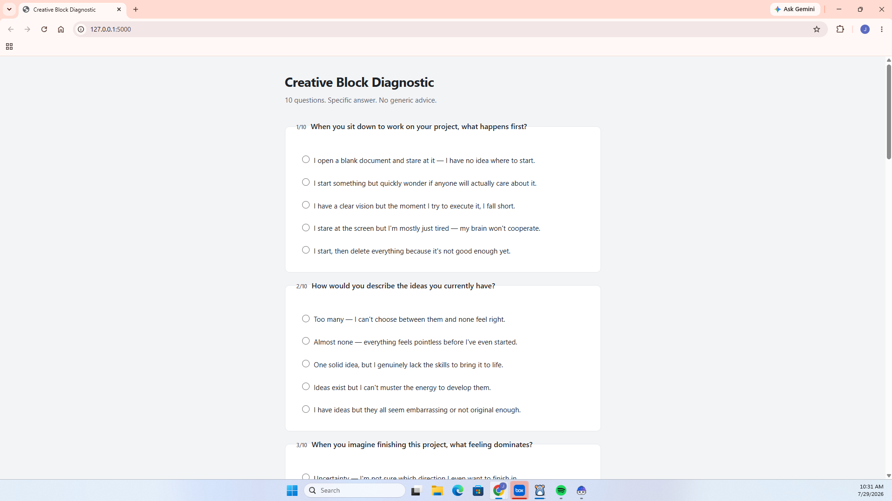
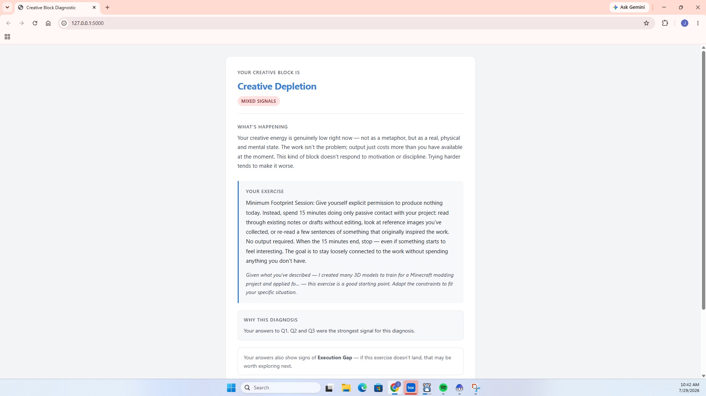

# Creative Block Diagnostic

A Flask web app that diagnoses *why* you're creatively stuck and gives you one specific, actionable exercise to get unstuck.

Answer ten questions, receive a scored diagnosis across five creative-block categories, and get a targeted exercise to break through — with optional AI-powered personalisation via IBM watsonx Granite.

---

## Problem Statement

Creative blocks are not uniform. "I can't start" looks the same on the surface whether you're paralysed by too many options, terrified of judgement, running on empty, or simply unable to close the gap between your vision and your skills. Generic advice — *"just start", "lower your standards", "take a break"* — fails because it doesn't distinguish between these fundamentally different problems.

There is no lightweight, free, self-serve tool that:
- Helps a person identify *which kind* of block they are experiencing
- Gives them a concrete, category-specific exercise rather than platitudes
- Works instantly without an account, subscription, or therapist

**Creative Block Diagnostic** is that tool.

---

## Solution Description

The app presents ten weighted multiple-choice questions about the user's creative situation. Each answer option carries per-category weights across five block types. The scoring engine sums the weights, ranks the categories by score, and produces:

- A **primary diagnosis** — the dominant block type
- A **secondary diagnosis** — surfaced when a second category scores within 25 % of the primary (common in real-world mixed states)
- A **confidence label** — derived from normalised Shannon entropy across all five category scores, so users know whether the result is clear-cut or ambiguous
- A **concrete exercise** — one specific, practical technique for the diagnosed block; no vague advice, no toxic positivity
- An **AI personalisation note** (optional) — if the user describes their specific situation, `ibm/granite-3-3-8b-instruct` on IBM watsonx generates 2–3 sentences connecting their context to the exercise

The entire diagnosis runs offline with no credentials required. The watsonx layer is a graceful enhancement, not a dependency.

---

## AI Approach and Architecture

### Scoring engine (`diagnostic.py`)

The core diagnostic is fully deterministic and requires no AI:

1. **Weighted answer accumulation** — each selected answer option contributes floating-point weights to one or more of the five categories
2. **Entropy-based confidence** — normalised Shannon entropy over the category score distribution determines whether the result is `high confidence`, `moderate confidence`, or `mixed signals`
3. **Secondary threshold** — a second diagnosis is only reported when it reaches ≥ 75 % of the primary score
4. **Contributing answers** — the top 2–3 questions that most drove the primary result are surfaced for transparency
5. **Follow-up questions** — when confidence is `mixed signals`, a pair of targeted follow-up questions for the top-two categories can be served to refine the diagnosis

### watsonx AI layer (`llm_client.py`)

Two AI capabilities are layered on top of the deterministic engine, both **optional and fail-safe**:

| Capability | Function | Model |
|---|---|---|
| **Exercise personalisation** | Given the user's free-text description of their situation, generates 2–3 sentences making the canonical exercise feel specifically written for them | `ibm/granite-3-3-8b-instruct` |
| **Context scoring** | Sends the user's free-text to watsonx for a conservative 0–10 score per category; the result is applied as a small secondary signal (≤ 0.8 pts per category, capped to ~20 % of one quiz question's weight) on top of the quiz scores | `ibm/granite-3-3-8b-instruct` |

Both functions return gracefully (empty string / `None`) on any failure — network error, missing credentials, bad JSON response, SDK exception. The app never raises and never blocks on an AI call.

### Architecture overview

```
Browser (single-page HTML/CSS/JS)
        │  GET /          – serves quiz UI
        │  POST /diagnose – JSON in, JSON out
        ▼
    app.py  (Flask)
        │
        ├─ diagnostic.py       Pure Python scoring engine
        │       ├─ questions.py        Question bank + follow-up questions
        │       ├─ interventions.py    Block descriptions + exercises
        │       └─ llm_client.py ──── IBM watsonx Granite (optional)
        │
        └─ static/             CSS
```

### Selected challenge theme

**Productivity & Wellbeing** — the tool addresses creative stagnation, a form of cognitive/emotional friction that directly affects personal productivity and creative output. The diagnostic-first approach (identify the root cause, then act) is meaningfully different from to-do list or time-management tools; it targets the *why* behind inaction, not just the *what*.

---

## How IBM Bob Was Used

This project was designed, scaffolded, and built end-to-end with **[IBM Bob](https://www.ibm.com/products/bob)**, an AI software engineer. Every file in the repository was either written by Bob or reviewed and refined through direct conversation with Bob. Specifically:

| What Bob did | Files |
|---|---|
| Scaffolded the Flask application — `GET /` and `POST /diagnose` routes, request parsing, response shaping, error handling | [`app.py`](app.py) |
| Designed and implemented the scoring engine — weighted accumulation, Shannon entropy confidence, secondary threshold, contributing-answer tracking, follow-up question logic | [`diagnostic.py`](diagnostic.py) |
| Authored the ten-question bank — wrote every question and its weighted answer options, calibrated so each block category is reliably identifiable from a full sweep | [`questions.py`](questions.py) |
| Defined the intervention library — wrote all five block descriptions and concrete exercises, with an explicit no-toxic-positivity constraint on the fatigue entry | [`interventions.py`](interventions.py) |
| Built the watsonx integration — Granite prompt templates, credential handling, offline fallback logic, graceful error recovery so the app never raises on LLM failure | [`llm_client.py`](llm_client.py) |
| Built the quiz UI — single-page HTML/CSS/JS front end, question renderer, fetch-based form submission, results display | [`templates/index.html`](templates/index.html) |
| Wrote the test suites — integration runner with unit tests (scoring, entropy, interventions, offline LLM path) and Flask integration tests; pytest-discoverable test file | [`_run_tests.py`](_run_tests.py), [`test_diagnosis.py`](test_diagnosis.py) |
| Authored the 25-persona evaluation suite — synthetic profiles covering clear-cut, mixed, and edge-case inputs to verify scoring consistency | [`eval_personas.py`](eval_personas.py) |
| Set up Docker, setup scripts, `.env.example`, and CI-ready project structure | [`Dockerfile`](Dockerfile), [`setup.sh`](setup.sh), [`setup.bat`](setup.bat), [`.env.example`](.env.example) |
| Maintained project documentation, git hygiene (commit messages, file renames, screenshot updates) | This README, [`LICENSE`](LICENSE) |

Bob was used interactively — decisions about architecture, framing, and content were made collaboratively. The watsonx prompt engineering, scoring thresholds, and block taxonomy were iterated through conversation before being committed.

---

## Block Categories

| Key | Name | What it is |
|---|---|---|
| `possibility` | Possibility Paralysis | Too many options; nothing feels justified |
| `purpose` | Purpose Void | The work feels hollow before it's started or finished |
| `skill_gap` | Execution Gap | Clear vision, but the skills aren't there yet |
| `fatigue` | Creative Depletion | Genuine low energy — pushing harder makes it worse |
| `judgment` | Judgment Block | Editing before creating; the inner critic blocks output |

---

## Screenshots

| Quiz | Diagnosis |
|---|---|
|  |  |

---

## Quick Start

**No IBM Cloud account required.** The app runs fully offline out of the box.

### Option A — Docker (fastest, zero Python/pip setup)

```bash
git clone https://github.com/kellermanj2-eng/creative-block-diagnostic.git
cd creative-block-diagnostic
docker build -t creative-block-diagnostic .
docker run -p 5000:5000 creative-block-diagnostic
```

Open [http://localhost:5000](http://localhost:5000). Done.

> To enable watsonx AI personalisation, pass credentials at run time:
> ```bash
> docker run -p 5000:5000 \
>   -e WATSONX_ENABLED=true \
>   -e WATSONX_URL=https://us-south.ml.cloud.ibm.com \
>   -e WATSONX_API_KEY=your_key \
>   -e WATSONX_PROJECT_ID=your_project_id \
>   creative-block-diagnostic
> ```

### Option B — Setup script (no Docker)

**Mac / Linux**
```bash
git clone https://github.com/kellermanj2-eng/creative-block-diagnostic.git
cd creative-block-diagnostic
bash setup.sh
source .venv/bin/activate
python app.py
```

**Windows**
```bat
git clone https://github.com/kellermanj2-eng/creative-block-diagnostic.git
cd creative-block-diagnostic
setup.bat
.venv\Scripts\activate
python app.py
```

### Option C — Manual setup

```bash
git clone https://github.com/kellermanj2-eng/creative-block-diagnostic.git
cd creative-block-diagnostic
python -m venv .venv
source .venv/bin/activate      # Windows: .venv\Scripts\activate
pip install -r requirements.txt
cp .env.example .env           # optional — only needed for watsonx
python app.py
```

Open [http://localhost:5000](http://localhost:5000) in your browser.

---

## Running the Tests

```bash
# Pytest (5 unit tests — runs in <1 s, no credentials needed)
pytest test_diagnosis.py -v

# Full integration suite (scoring, entropy, Flask routes, offline LLM path)
python _run_tests.py

# 25-persona evaluation suite
python eval_personas.py
```

---

## Environment Variables

Copy `.env.example` to `.env`. All variables are optional — the app runs fully offline without any of them.

| Variable | Default | Description |
|---|---|---|
| `WATSONX_ENABLED` | `false` | Set to `true` to enable LLM personalisation |
| `WATSONX_URL` | — | Your watsonx endpoint, e.g. `https://us-south.ml.cloud.ibm.com` |
| `WATSONX_API_KEY` | — | IBM Cloud API key |
| `WATSONX_PROJECT_ID` | — | watsonx project ID |
| `WATSONX_MODEL_ID` | `ibm/granite-3-3-8b-instruct` | Model to use for personalisation |
| `FLASK_DEBUG` | `false` | Enable Flask debug mode |

---

## API

### `GET /`
Serves the quiz UI.

### `POST /diagnose`
Accepts a JSON body and returns the diagnosis.

**Request**
```json
{
  "answers": {
    "q1": 4,
    "q2": 4,
    "q3": 4,
    "q4": 4,
    "q5": 4
  },
  "context": "Optional free-text about your specific situation"
}
```

**Response**
```json
{
  "primary": "judgment",
  "primary_name": "Judgment Block",
  "primary_description": "...",
  "exercise": "...",
  "personalization": "...",
  "secondary": "possibility",
  "secondary_name": "Possibility Paralysis",
  "scores": { "possibility": 5, "purpose": 0, "skill_gap": 0, "fatigue": 0, "judgment": 20 }
}
```

`personalization` is an empty string when watsonx is disabled or no context was provided.  
`secondary` and `secondary_name` are `null` when no second block scores within 25 % of the primary.

---

## License

MIT — see [LICENSE](LICENSE).
